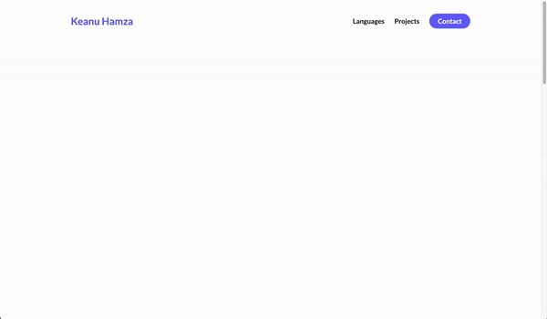

# E-PORTFOLIO FOR KEANU 

## What is it?

- Designed and developed client's e-portfolio using semantic HTML5 and CSS3 (+BEM) best practices.
- Included responsive and multi-platform support to enable the eportfolio to be viewed across any devices and platforms

## Why did I create this?

Practice SPA using HTML5, CSS3, JS Frameworks

## How to get it running -

It should be accessible through [here](https://diy-a.github.io/keanu-eportfolio)

